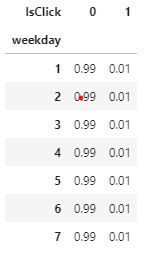
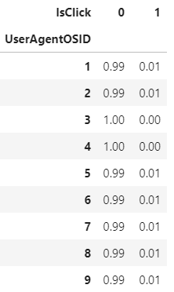

# Big Data Project- Jieqiao Luo

The requirements and the description of the dataset are [here](dataset-and-requirements.md).

# Executive Summary
The project aims to explore contextual ads and predict whether a contextual ad will be clicked if a search expression is given. It includes the exploration of history click rate, ad position in a page, user login status, search query status, search information, user information and so on. pivot tables are given as results of exploration of relationship between different factors and ad'click status. Factors are chosen according to the pivot tables to find possible important factors for prediction of contextual ad click. Different classifier models are used to predict contextual ads' click including random forest, logistic regression. 

# Methods
It includes steps to read dataset, find distinct variables for features, check null value for features, remove duplicate data, plot pie chart to find proportion for three different types of ads, filter to get search_lcik dataset which only contain contextual ads. Additionally, there are several tables explored.

There are hypotheses shown on the following questions.

1. Different positions of ads have different proportion for click status.
2. Different click statuses have different history click through rate
3. Different User login statuses have different proportion for click status.
4. Different Search queary statuses have different proportion for click status.
5. Different search locations have different proportion for click status.
6. Different search category have different proportion for click status.

### 1) search_click_table is explored individually. Type of ads and contextual ads' click distirbution are explored by using pie chart.

From ads' type distribution pie chart, contextual ad has the most percentage, 48.5%, compared with regular free ads and highlighted regular ads. It is reasonble to only explore contextual ads.

From click status distribution of contextual ads, there is an extremely imbalanced dataset where percetenge of events to click contextual ads is only 0.6% (1146289). 

For the table of HistCTR distribution in different click status, there is obvious higher history click through rate for clicked ads.

### 2) search_click table is used to join with search_info table to find if User Login status, SearchQuery, Search Location, Search Category have correlation with click status. Search Params is not used since it is spanish and it is hard to deal with.

SearchQuery is transformed as 0 and 1 to represent if there is a search query text for a search event.
From the pivot table of SearchQuery and Click status(IsClick), there is no obvious difference for no query text search event and query text search event. Therefore, this feature is not considered when predicting click status of a search event.

From the pivot tabel of user login status(IsUserLoggedon) and Click status(IsClick), there is no obvious difference for click status distribution between users who login in and user who do not login in. This feature will not be considered when predicting click status.

From the pivot table of days of a week and Click status, there is no obvious difference of click status distribution among searcn events in different days of a week. 

From the pivot table of month and click status, there is also no obvious difference of click status distribution for searcn events on different months. Therefore, date will not be considered when predicting click status.

### 3) search_click table is used to join with search_info table and user_info to find if there is any factor of user information affecting the click status. From distinct variable count of features, User Agent OS is a a good feature to try to figure out if it can affect status(Isclick),

From the pivot table of UserAgentID and click status, there are some difference of click status distribution among different User Agent 

### 4) search_click table is used to join with search_info table and category to find if there is any factor of search category information affecting the click status. Based on distinct variables of features, search category level and parent category are chosen to look by using pivot table with IsClick. 

From the pivot table of search category level and click status, there are some difference of click status distribution among search category level. It can be used to predict click status.

From the pivot table of search parent category and click status, there are some difference of click status distribution among different search parent categories. It can be used to predict click status.

### 5) search_click table is used to join with location table to find if if there is any factor of search location information affecting the click status.  Based on distinct variables of features, search location level is chosen to look by using pivot table with IsClick. 

From the pivot table of location level and click status, there are some difference of click status distribution among search location level (3=city, 2=region, 1=county). It can be used to predict click status.

### Model
After figuring out potential factors that affect click status, logistc regression and random Forest model are chosen to predict if a search event will lead a contextual ad click. Logistc regresssion is chosen since it is commonly used in binary classification and it is fast to train for tremendous data. Random Forest is used since it can handle imbalance dataset.  The AUC and AUPR(precision-recall) are used to evaluate perforamce of models.

### Challenges 
It is so hard to draw data visualization for tremendous data. Groupby, count, min, max percentile function are used to create pivot tables to show a clear reasult for features relationships. It is also hard to deal with imbalance dataset when training mdoel especially, there is only 0.6% minor label for the target variable. Random Forest is used to handle imbalance dataset and     is used to balance dataset.

# Results/Conclusions

Random Forest has a litt prediction ability for click status.

However, the AUPR is so lower, it means it has almost no prediction ability for ads click

Logistic regression can not be used to predict clickc status since the AUC is 0.5 which means there is no discrimination than guessing the result. 

AUPR is smaller than aupr of random forest.

The prediction of ads click is much hard than expected. The reason might be an extreme imbalance dataset.

# Future work:
Imbalanced dataset will be processed by undersampling and oversampling to improve prediction performance of models.
Model performace will be imporved by using further feature engineering and more models.

Combined_"stream is a great table to use for the analysis of non-contextual ads. Combining ad_info, combined_stream, user_info, category, location tables can explore if phone visit can be predicted and how the non-contexutal ads are affected by other factors. Also, samples will be taken to draw diverse data visualization besides table results. Clutering can also be used to find different click rate groups' potential characteristics.

# Takeaways from the course
Distributed data processing, hadoop, Mapreduce, pyspark, pipelines, use of linux, AWS EMR are what I got from this course. 

# Code file
Project.ipynb is the code file for the whole project
