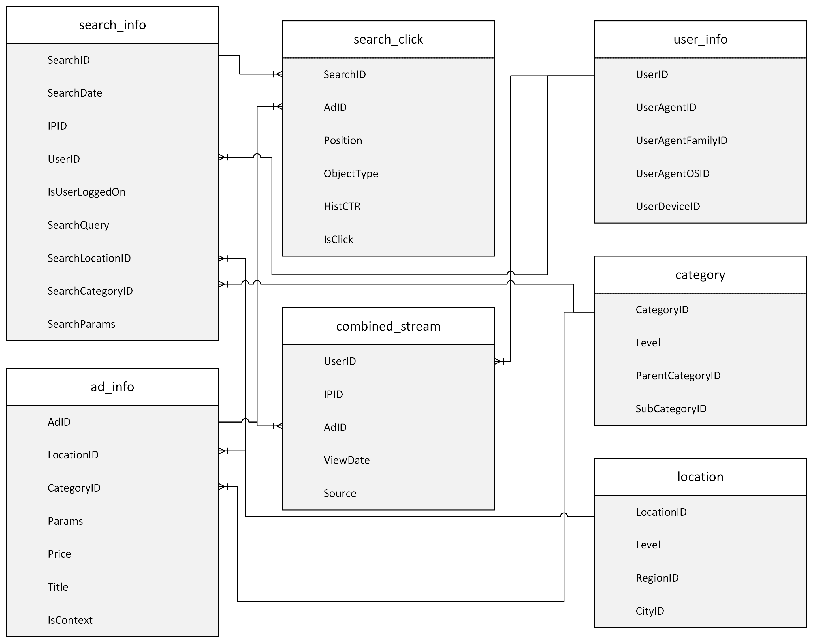
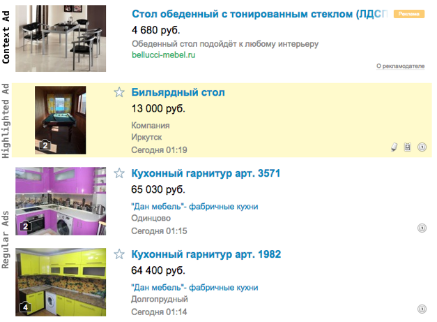
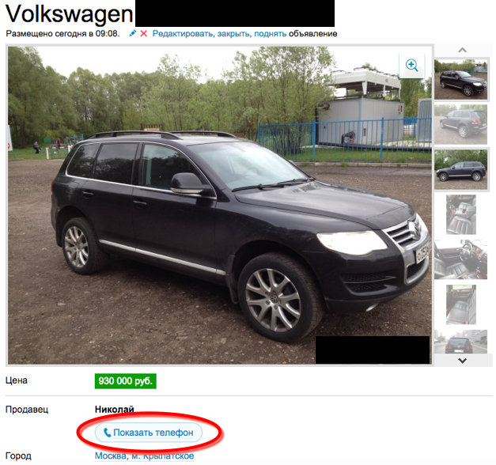

# Big Data Project

The goal of the project is to identify one or more question of interest based on a large dataset to produce an interesting result. You are welcome to use any combination of the tools we learned in class, or any cloud platform. You are also welcome to use other tools/techniques not specifically learned in class, as long as using them is is **in addition to** and not instead of the tools learned in class.

## Dataset Description and Location

### Location

The data files are located in both AWS and Azure

* AWS: `s3://bigdatateaching/project-data/`
* Azure: `wasbs://public@bigdatateaching.blob.core.windows.net`

The dataset was extracted from an online advertising company's systems. Here is [Entity Relation Diagram](https://en.wikipedia.org/wiki/Entity%E2%80%93relationship_model) of the data. The data is provided in _tab-delimited files_.

### `search_click`

`search_click` is a random sample of previously selected users' searches on the platform during at least 16 consecutive days from April 25 2015 until the target impression. Different types of ads on the site are shown in the picture below:

Regular ads are shifted down constantly as new ads come in. (Normally, a visitor's search results are sorted by the time an ad is submitted to the platform). Each line in the file describes one "impression" (an ad that is shown to a particular user based on a search). 

| Field Name | Description |
|------------|---------------
| SearchID | Identifier for a visitors's search event |
| AdID | Identifier of the ad (see also ad description in `ad_info`).
| Position | position of the ad in search result page (1 - is first ad on a page starting from the top). Only ads on position 1, 2, 6, 7, and 8 are logged.
| ObjectType | Type of the ad shown to user. The options are: `1` - regular free ads added by users; `2` - highlighted regular (owners have to pay fixed price to highlight them and stick to the top for some period of time); `3` - contextual ads (owners have to pay per visitor's click).
| HistCTR | Some naive history-based estimation of click-through rate for contextual ads, calculated when the ad is showed. For non-contextual ads this field equals NULL.
| IsClick | `1` if there was a click on this ad. Otherwise `0`. For non-contextual ads this field equals NULL. The goal of this competition is to make a click prediction model for contextual ads.

### `combined_stream`

These are samples of users' visits to non-contextual ad landing pages and the corresponding phone request (if one occurred). Each ad's landing page shows the hidden seller's phone number. To be able to contact the seller, the user needs to click the request phone button:

Consequently, a user's phone request event could be considered a proxy for a user's response to the advertisement. We believe that clicking the phone request indicates a high level of interest in the ad.

| Field Name | Description |
|------------|---------------
| UserID | Anonymized identifier of visitor's cookie (see also `user_info`).
| IPID | Anonymized identifier of visitor's IP.
| AdID | Identity of the ad's landing page visited by user (see also `ad_info`).
| ViewDate | Date and time of viewing the ad
| Source | Whether the view was from a site visit or phone

### `search_info`

| Field Name | Description |
|------------|---------------
| SearchID | Identifier of search event.
| SearchDate | Date and time of the search event.
| UserID | Anonymized identifier of visitor's cookie.
| IsUserLoggedOn | Whether user was logged on with his/hers login (1) or not (0).
| IPID | Anonymized identifier of visitor's IP.
| SearchQuery | Raw query text if it was specified while search. NULL otherwise.
| SearchLocationID | Identifier of the location where search was made (see also `location`).
| SearchCategoryID | Category filter of the search (see also `category`).
| SearchParams | Dictionary-like structure with optional filters of the search if they were specified while search. `NULL` otherwise.

### `ad_info`

| Field Name | Description |
|------------|---------------
| AdID | Identity of an ad.
| LocationID | Ad's geo-targeting. (references `location` for regular ads). NULL for contextual ads.
| CategoryID | Ad's category according to the classification model. (references `category`)
| Params | Parameters for the context ad in dictionary-like format. NULL for some ads (where no parameters are available).
| Price | Price for an ad
| Title | Raw title text.

**Note:** `Params` from `ad_info` and `SearchParams` from `search_info` share same dictionary (keys and values). The Params are semi-structured to reflect the nature of the search and the product. For example, the Params for clothing might be gender, size, color, brand; while the Params for houses might be size, # of bedrooms, # of bathrooms, etc.

### `user_info`

| Field Name | Description |
|------------|---------------
| UserID | Anonymized identifier of visitor's cookie.
| UserAgentID | Anonymized identifier of user's browser.
| UserAgentFamilyID | Anonymized identifier of user's browser family (Chrome, | Safari, etc).
| UserAgentOSID | Anonymized identifier of user's OS derived from browser family.
| UserDeviceID | Anonymized identifier of user device type and model (Samsung GT-I9500, iPhone, etc.)

### `location` 

| Field Name | Description |
|------------|---------------
| LocationID | Identifier of the location.
| Level | Level of search/impression (3 = city, 2 = region, 1 = country)
| RegionID | Identifier of the search/impression region.
| CityID | Identifier of the search/impression city.

### `category`

| Field Name | Description |
|------------|---------------
| CategoryID | Identifier of the category.
| Level | Level of category for search/impression/ad (3 = subcategory, 2 = category, 1 = total)
| ParentCategoryID | Identifier of parent category.
| SubcategoryID | Identifier of subcategory that has parent category.

Note that some users from `search_click` may not have any historical information in `combined_stream`.

